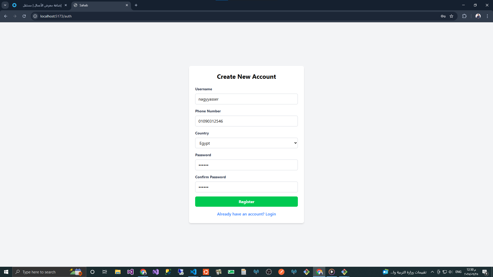
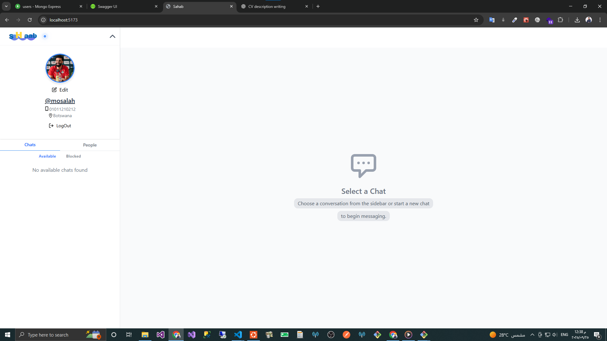
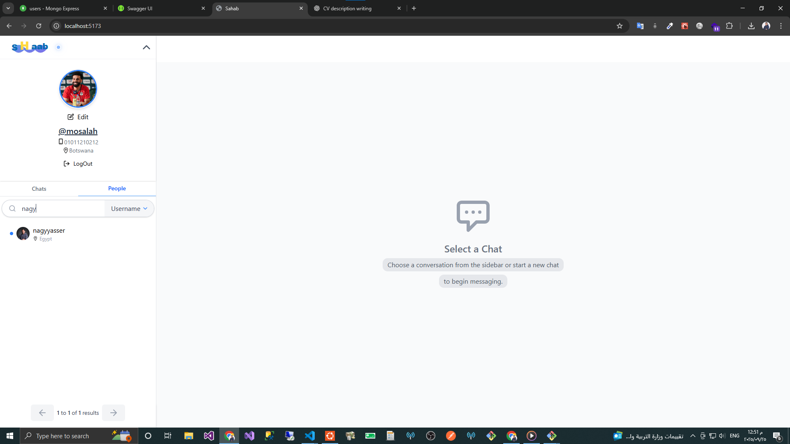
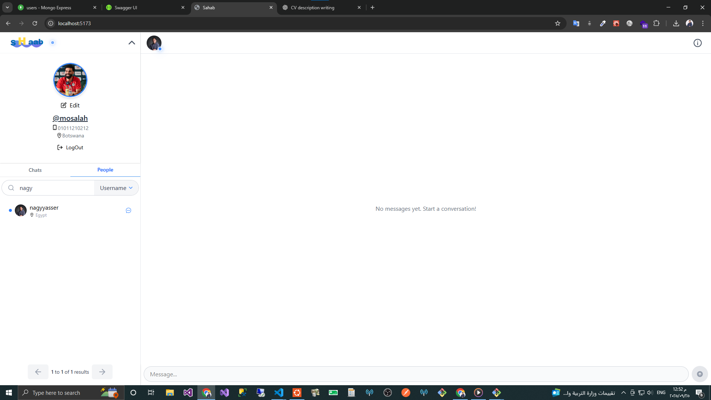

# SaHab - Real-Time Chat Application

SaHab is a modern real-time chat application built with React and NestJS, offering seamless communication features with a focus on performance and user experience.



## Features

- 🔐 **Authentication & Authorization**

  - Secure JWT-based authentication
  - Protected routes and WebSocket connections
  - User registration and login
  - Password change functionality

- 💬 **Real-time Communication**

  - Instant messaging with WebSocket integration
  - Message status indicators (sent, delivered, read)
  - Typing indicators
  - Online/offline status

- 👥 **User Management**

  - User profiles with avatars
  - User search functionality
  - Online status tracking
  - User blocking capabilities

- 🗨️ **Chat Features**

  - One-on-one conversations
  - Group chats
  - Message history with pagination
  - File and image sharing
  - Message editing and deletion

- 🎨 **Modern UI/UX**
  - Responsive design
  - Message skeletons for loading states
  - Real-time updates
  - Image preview popups
  - Clean and intuitive interface

## Technology Stack

### Frontend

- **React** with TypeScript
- **Redux Toolkit** for state management
- **Socket.IO** client for real-time communication
- **Vite** for fast development and building
- **Axios** for HTTP requests
- **NGINX** for production serving

### Backend

- **NestJS** framework
- **MongoDB** with Mongoose
- **Redis** for caching and real-time features
- **Socket.IO** for WebSocket communication
- **JWT** for authentication
- **Docker** for containerization

## Screenshots

### Chat Interface


_Main chat interface with real-time messaging_

### User Profile


_User profile management and settings_

### Message Features


_Rich messaging features including status indicators_

## Getting Started

### Prerequisites

- Node.js (v16 or higher)
- MongoDB
- Redis
- Docker (optional)

### Development Setup

1. **Clone the repository**

   ```bash
   git clone https://github.com/nagiyasserahmed/Sahab
   cd Real-Time-Chat-App
   ```

2. **Frontend Setup**

   ```bash
   cd client
   npm install
   # Copy the example env file and update it
   cp .env.example .env
   npm run dev
   ```

3. **Backend Setup**
   ```bash
   cd server
   npm install
   # Copy the example env file and update it
   cp example.env .env
   npm run start:dev
   ```

### Docker Setup

The application can also be run using Docker:

```bash
docker-compose up -d
```

This will start both the frontend and backend services, along with MongoDB and Redis instances.

## Environment Variables

### Frontend (.env)

```
VITE_API_URL=http://localhost:3000
VITE_WS_URL=ws://localhost:3000
```

### Backend (.env)

See `example.env` in the server directory for required environment variables.

## Project Structure

```
├── client/                # Frontend React application
│   ├── src/
│   │   ├── api/          # API and WebSocket setup
│   │   ├── components/   # React components
│   │   ├── features/     # Feature modules
│   │   └── store/        # Redux store configuration
│
└── server/               # Backend NestJS application
    ├── src/
    │   ├── modules/     # Feature modules
    │   ├── config/      # Configuration
    │   └── shared/      # Shared resources
```

## License

This project is licensed under the MIT License - see the [LICENSE](LICENSE) file for details.

## Acknowledgments

- Special thanks to all contributors
- Inspired by modern chat applications
- Built with ❤️ using React and NestJS
